# Biblioteca-Mongo
Taller de sofka crear con Spring Boot y MongoDB una aplicación que permita administrar un biblioteca publica.
## Recursos
- Se utilizo Spring Boot (java 11)
- Mongodb Atlas
- Postman 

## Servicios consultados por Postman

1. POST
    ```
   http://localhost:8080/recursos/crear
   ```
   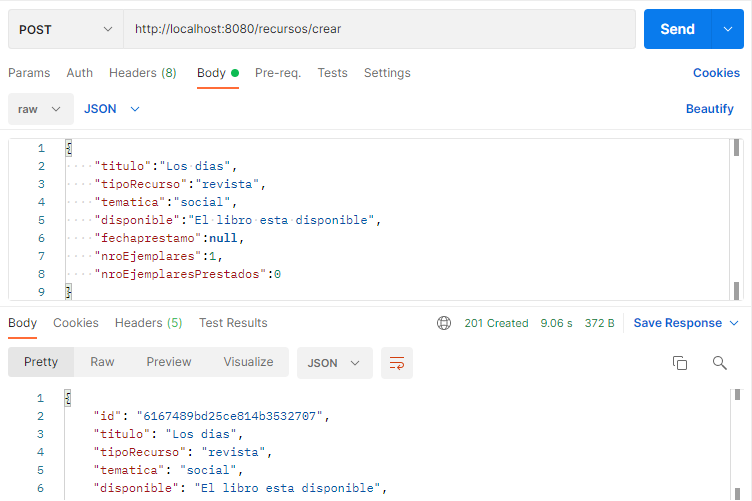

   Base de datos
   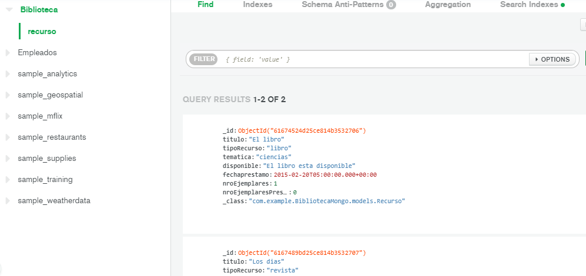
2. GET
   ```
   http://localhost:8080/recursos
   ```
   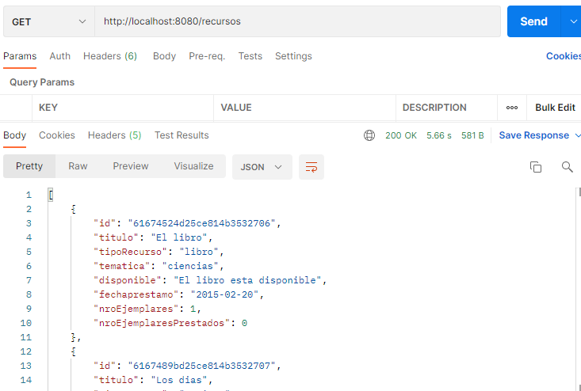
   ```
   http://localhost:8080/recursos
   ```
   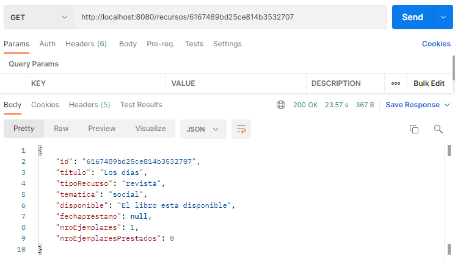
3. PUT
   ```
   http://localhost:8080/recursos/modificar
   ```
   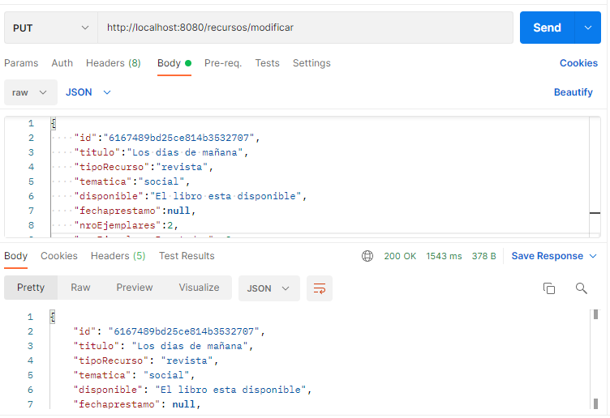
4. DELETE
   ```
   http://localhost:8080/recursos/6167489bd25ce814b3532707
   ```
5. OTRAS
   - Consultar disponibilidad de un recurso indicando en un mensaje si esta disponible o no. en caso de no estar disponible presentar la fecha del préstamo actual del ultimo ejemplar.
   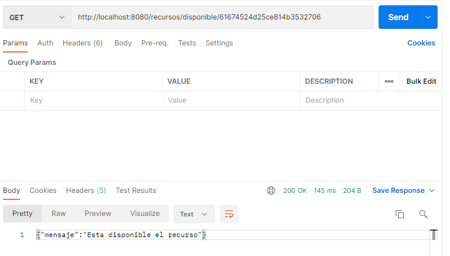
   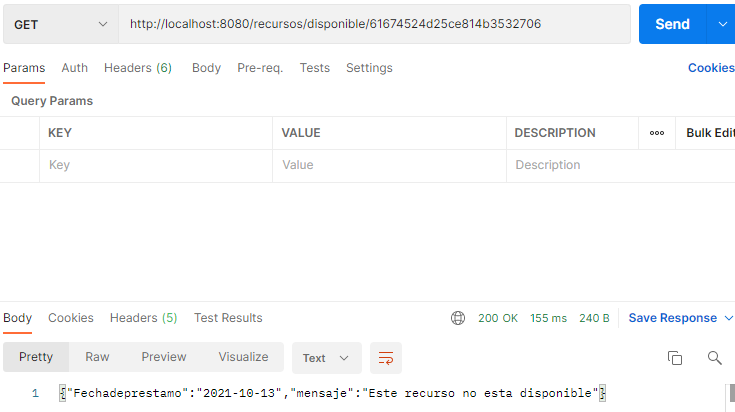
   - Prestar un recurso, se debe comprobar si esta prestado o no, indicarlo mediante un mensaje. Si se encuentra disponible debemos marcarlo como prestado y registrar la fecha del préstamo (no es necesario llevar el historia de prestamos).
   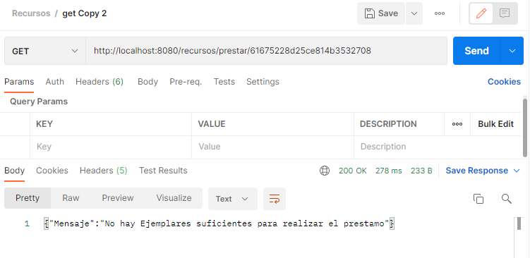
   
   - Devolver un recurso que se encontraba prestado, obviamente si un recurso no se encuentra en préstamo no podrá ser devuelto. Indicar el resultado con un mensaje.
   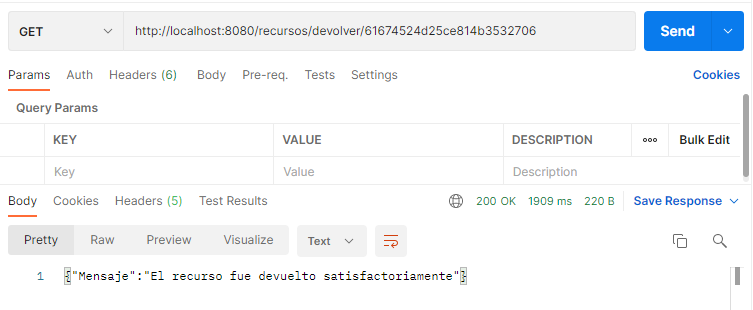
   - Recomendar un listado de recursos al usuario a partir del tipo de recurso, del área temática o de los dos. Los recursos están clasificados por tipo de recurso (libros, revistas, fichas, etc) pero también por área temática (ciencias, naturaleza, historia, etc).
   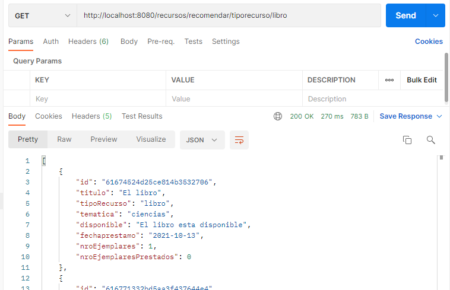
   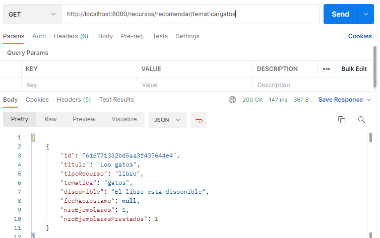
   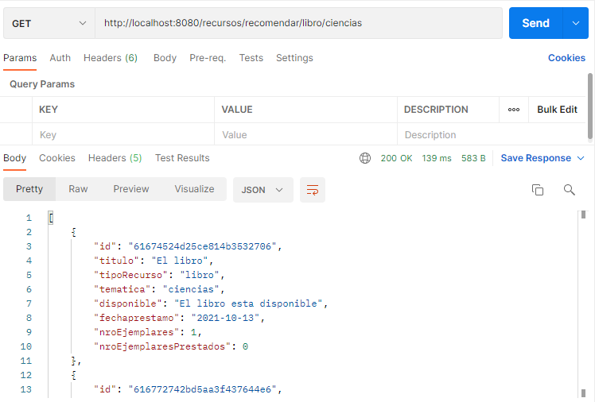
